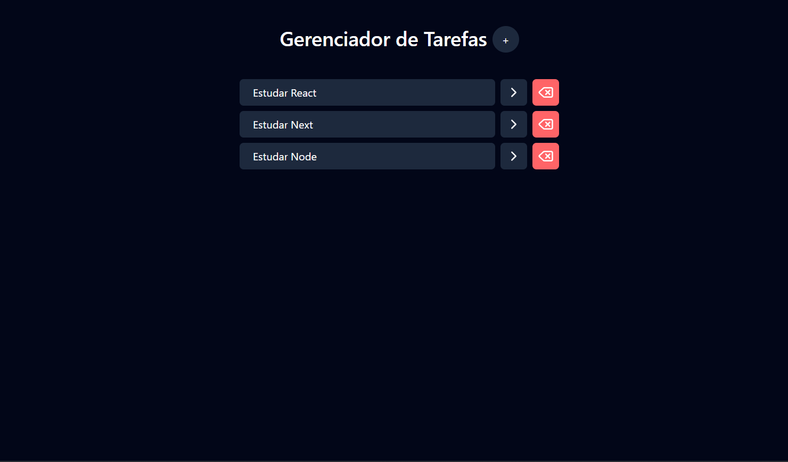

🌟 Projeto TODO — React + Tailwind + Maps

✨ Sobre o Projeto

Um aplicativo simples, rápido e moderno para gerenciar suas tarefas.
Construído com foco em performance, responsividade e experiência do usuário, incluindo:

⚛️ React JSX para UI dinâmica
🎨 TailwindCSS para estilo rápido e elegante
🗺️ Integração com Mapas
🧠 Funções reutilizáveis e organizadas
✔️ Validações completas
🎯 Funcionalidades

Criar, editar e remover tarefas
Interface minimalista e responsiva
Marcação e visualização de pontos no mapa
Feedback visual com Tailwind
Estrutura escalável e limpa

📸 Demonstração

  

🛠️ Instalação e Uso
# 1. Instalar dependências
npm install

# 2. Rodar em modo desenvolvimento
npm run dev

# 3. Build para produção
npm run build

📁 Estrutura do Projeto
/
├─ src/
│  ├─ components/    # Componentes reutilizáveis
│  ├─ pages/         # Páginas principais
│  ├─ styles/        # Estilos globais
│  └─ App.jsx
└─ public/

🚀 Roadmap (Próximos Passos)
🌙 Tema escuro
🔐 Login e autenticação
☁️ Sincronização na nuvem
📱 Versão mobile (PWA)
🔄 Integração com banco de dados
🤝 Contribuição

Contribuições são bem-vindas!

# Criar branch
git checkout -b minha-contrib
# Enviar alterações
git commit -m "Minha contribuição"
git push origin minha-contrib

👤 Autor
Sebastião Rodrigo.
🔗 Posso adicionar links para GitHub, LinkedIn e Portfólio. Só me diga quais!

⭐ Mostre seu apoio

Se este projeto te ajudou, deixe uma ⭐ no repositório!
